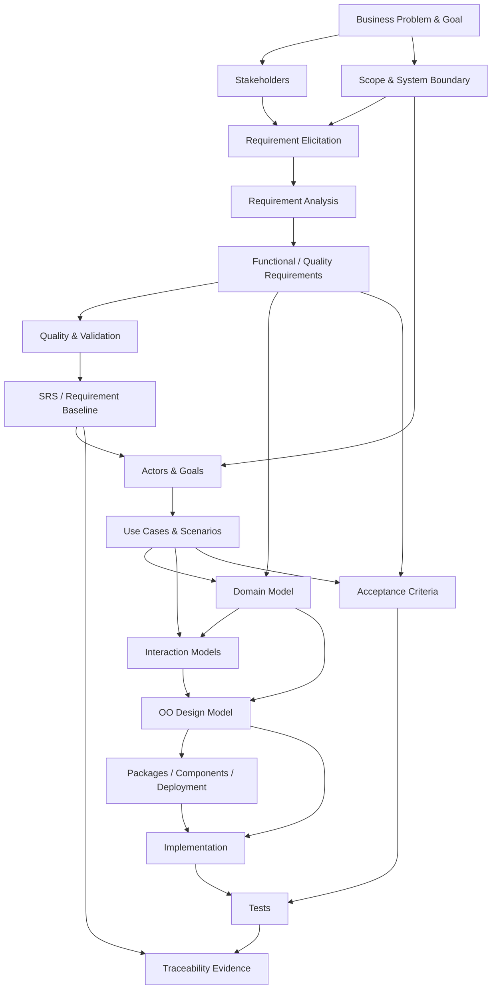
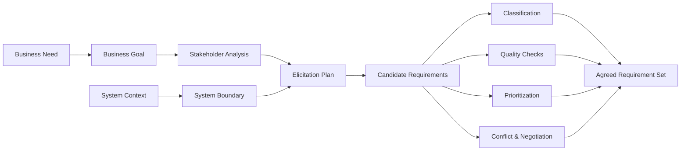
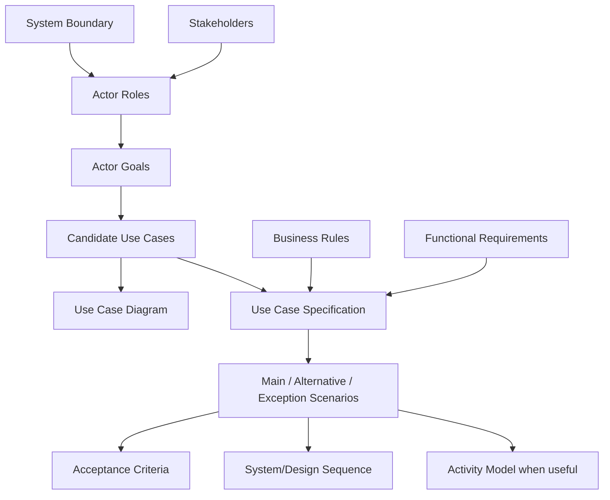
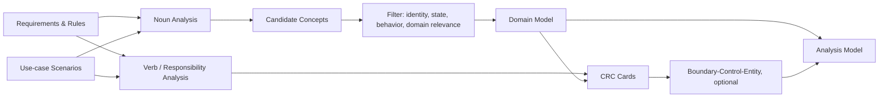
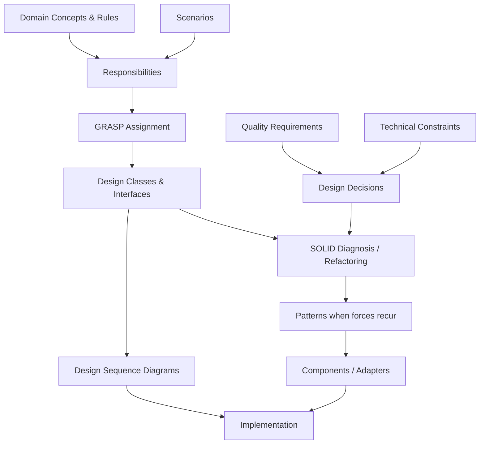
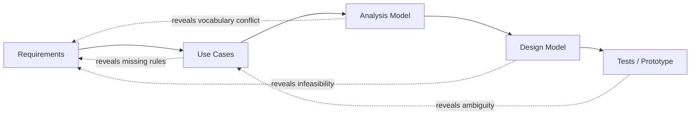

# Dependency Map giữa các Concept

## 1. Cách đọc dependency map

Mũi tên `A → B` nghĩa là **A cung cấp mental model hoặc input cần thiết để học/tạo B một cách có ý nghĩa**. Nó không có nghĩa mọi dự án bắt buộc phải tạo artifact A trước artifact B theo waterfall.

Ba loại dependency:

- **Concept prerequisite:** phải hiểu A trước khi học B.
- **Artifact input:** output của A là input của B.
- **Validation link:** A và B phải đối chiếu hai chiều dù thứ tự tạo có thể lặp.

Requirements và model luôn phát triển lặp. Dependency map ngăn việc nhảy cóc về reasoning, không cấm feedback loop.

## 2. Critical learning path



Critical path ngắn nhất:

> Problem → Boundary → Requirements → Scenario → Domain → Responsibilities → Collaboration → Code → Test

## 3. Requirements cluster



### Dependency rules

| Concept | Cần trước | Mở khóa | Lý do |
|---|---|---|---|
| Stakeholder analysis | Business problem/context | Elicitation, prioritization | Không biết ai có interest/authority thì dễ thu thập sai nguồn |
| System boundary | Context, goal | Actor, FR, interface requirement | Một hành vi chỉ là “system behavior” khi boundary đã rõ |
| Elicitation technique | Stakeholder + information need | Candidate requirements | Technique được chọn theo uncertainty, không theo thói quen |
| Requirement classification | Candidate requirements | SRS organization, review | Phân biệt behavior, quality, rule và constraint |
| Quality attributes | Functional context | Measurable quality scenarios | “Nhanh/an toàn” chỉ có nghĩa trong stimulus, environment và measure cụ thể |
| Prioritization | Value, risk, dependency, cost | Release scope | MoSCoW label không tự tạo priority hợp lý |
| Negotiation | Conflict + decision authority | Agreed baseline | Conflict không thể giải bằng rewrite câu chữ đơn thuần |

## 4. Specification & validation cluster

```text
Candidate requirement
  → quality check
  → rewrite / clarify
  → acceptance criterion
  → stakeholder validation
  → baseline/version
  → trace links
```

| Artifact/concept | Upstream | Downstream validation |
|---|---|---|
| SRS | Scope, stakeholder needs, agreed requirements | Use cases, interfaces, tests |
| Acceptance criteria | Requirement intent, examples, business rules | Acceptance tests and review evidence |
| RTM | Stable IDs across artifacts | Impact analysis and coverage report |
| Requirement review | Draft specification + reviewer roles | Defect log and decision log |

### Verification vs validation dependency

- Phải hiểu requirement quality trước **verification**: artifact có đúng quy tắc, nhất quán và đủ chất lượng không?
- Phải hiểu stakeholder goal/context trước **validation**: ta có mô tả đúng nhu cầu thực không?
- Một requirement có thể được viết rất rõ nhưng vẫn giải quyết sai vấn đề.

## 5. Use-case cluster



### Các dependency dễ bị đảo ngược

- **Actor không phụ thuộc UI screen.** Actor là role/external entity có goal với system.
- **Use case không bắt đầu từ database table.** Nó bắt đầu từ actor goal có giá trị.
- **`include`/`extend` không dùng để biểu diễn thứ tự thời gian.** Sequence/activity đảm nhiệm câu hỏi đó.
- **Diagram không thay specification.** Diagram cho overview; flow và guarantee nằm trong specification.

## 6. OO Analysis cluster



### Candidate-class filter

Một noun chỉ trở thành domain concept/class candidate khi ít nhất một câu hỏi có câu trả lời thuyết phục:

- Nó có identity cần theo dõi không?
- Nó có state/lifecycle riêng không?
- Nó bảo vệ invariant hoặc business rule nào?
- Nó là value có meaning và equality semantics riêng không?
- Nhiều scenario cần nói về nó như một khái niệm ổn định không?

UI control, database, report title, vague manager noun hoặc attribute đơn giản thường không phải domain class ở analysis stage.

## 7. UML selection dependencies

Không học/vẽ mọi diagram theo danh sách bắt buộc. Chọn theo uncertainty:

| Modeling question | Input cần có | Diagram phù hợp | Output dùng cho |
|---|---|---|---|
| Ai đạt goal nào trong boundary? | Actor-goal list | Use Case | Scope review, use-case inventory |
| Domain concept liên hệ thế nào? | Requirements, vocabulary | Domain/Class | Invariant, multiplicity, design input |
| Scenario cộng tác theo thời gian ra sao? | Use-case scenario + participants | Sequence | Responsibility/operation design |
| Workflow có branch/parallelism ra sao? | Process/scenario steps | Activity | Process validation, orchestration |
| Một entity đổi state theo event nào? | Lifecycle rules/events | State Machine | Valid transition, State design/testing |
| Modules phụ thuộc theo hướng nào? | Responsibilities + dependency policy | Package | Modularity and build organization |
| Runtime parts cung cấp interface gì? | Design/architecture decisions | Component | Integration boundaries |
| Artifact chạy ở đâu? | Quality needs + runtime topology | Deployment | Availability, security, operations |

### Conditional paths

```text
Nếu có lifecycle phức tạp        → State Machine
Nếu có workflow nhiều role       → Activity Diagram
Nếu có collaboration khó hiểu    → Sequence Diagram
Nếu dependency/module boundary mơ hồ → Package/Component Diagram
Nếu quality phụ thuộc topology    → Deployment Diagram
```

## 8. Analysis-to-design dependencies



### Thứ tự reasoning được khuyến nghị

1. Scenario cần hoàn thành hành vi gì?
2. Thông tin nào cần để ra quyết định?
3. Object nào là Information Expert?
4. Ai tạo object và ai điều phối system event?
5. Responsibility có cohesive không, coupling có chấp nhận được không?
6. Requirement nào dự báo variation thực tế?
7. Abstraction/pattern nào giải quyết force đó với chi phí hợp lý?

SOLID và pattern nằm **sau** responsibility analysis. Dùng chúng trước problem thường dẫn đến interface/class không có giá trị.

## 9. Pattern prerequisites

| Pattern | Nên học sau khi hiểu | Problem signal |
|---|---|---|
| Factory | Polymorphism, Creator, construction dependency | Client không nên biết concrete construction |
| Strategy | Composition, polymorphism, OCP | Algorithm/policy thay đổi độc lập |
| Observer | Event semantics, coupling, consistency | Nhiều subscriber phản ứng với state change |
| Adapter | Interface, external boundary, DIP | Interface bên ngoài không khớp model nội bộ |
| Decorator | Interface substitution, composition | Thêm behavior theo tổ hợp/runtime |
| Facade | Subsystem boundary, coupling | Client cần entry point đơn giản và ổn định |
| Command | Request as object, undo/queue/log | Cần đóng gói, trì hoãn hoặc ghi lại action |
| State | State machine, polymorphism | Behavior thay đổi đáng kể theo lifecycle state |

Pattern là dependency **có điều kiện**, không phải checkpoint bắt buộc cho mọi feature.

## 10. End-to-end traceability map

| Source | Trace tới | Câu hỏi coverage |
|---|---|---|
| Business goal | Business/system requirements | Requirement có tạo giá trị đã nêu không? |
| Requirement | Use case/scenario/quality scenario | Hành vi hoặc chất lượng được quan sát ở đâu? |
| Business rule | Flow, guard, invariant, validation | Rule được enforce ở tất cả đường đi liên quan chưa? |
| Use-case step | Message/responsibility | Ai thực hiện phản ứng hệ thống? |
| Domain concept | Design class/value/schema | Semantic có bị mất hoặc bóp méo không? |
| Quality requirement | Design decision/component/deployment | Cấu trúc nào giúp đạt measure? |
| Design decision | Code + test | Implementation có giữ decision/rationale không? |
| Requirement/criterion | Test case/result | Có evidence pass/fail không? |

## 11. Feedback loops

Dependency không đồng nghĩa tuyến tính một chiều:



Khi downstream artifact làm lộ vấn đề upstream, cập nhật nguồn và trace links; không “sửa” riêng diagram/code để che requirement defect.

## 12. Anti-dependency rules

Các shortcut cần tránh:

- UI mockup → database schema → gọi đó là requirements.
- Noun list → class diagram mà không lọc concept.
- Use-case diagram → sequence diagram mà không có textual scenario.
- Domain class → một bảng database theo ánh xạ 1:1 mặc định.
- Mỗi use case → một Controller class bất kể cohesion.
- NFR “secure/scalable” → chọn technology mà không có measurable scenario.
- Pattern catalog → ép pattern vào design chưa có variation/problem.
- Code hiện có → tạo requirement hồi tố mà không xác minh business intent.

