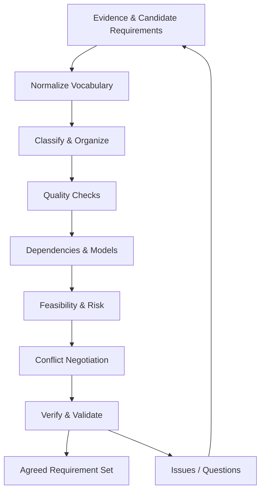

# Requirement Analysis

> **Mục tiêu:** chuyển candidate requirements rời rạc thành một model nhất quán về scope, behavior, rules, quality, dependencies và decisions.

## Learning outcomes

Sau bài này, bạn có thể:

- classify và organize requirements;
- phát hiện ambiguity, omission, conflict, inconsistency và over-specification;
- phân tích dependency, feasibility, completeness và verifiability;
- dùng models/tables để kiểm tra requirements;
- negotiate conflicts theo interest, evidence và authority;
- tạo issue log và requirement analysis record.

## 1. Analysis là gì?

**Requirement analysis** là reasoning để hiểu, cấu trúc, làm rõ, đánh giá và thống nhất candidate requirements trước và trong khi specification phát triển.

Elicitation trả về raw evidence và nhiều góc nhìn. Analysis trả lời:

- statement thuộc loại/mức nào?
- semantic thực sự là gì?
- có cần thiết và trong scope không?
- liên quan/depend vào requirement nào?
- có xung đột, thiếu hoặc trùng không?
- có khả thi và testable không?
- ai có quyền resolve uncertainty?

Analysis không kết thúc một lần. Use case, domain model, design và test tiếp tục làm lộ defect.

## 2. Analysis workflow

## 3. Normalize vocabulary và scope

Trước khi đánh giá câu chữ, thống nhất meaning:

- `Customer`, `User`, `Account Holder` có phải cùng role?
- `Order accepted` là payment authorized hay restaurant accepted?
- `Cancel` khác `reject`, `expire`, `fail` thế nào?
- Timezone/currency/business day được hiểu ra sao?

### Glossary entry mẫu

| Term | Definition | Not the same as | Source/owner |
|---|---|---|---|
| Quote | Snapshot giá có expiry, chưa phải Order | Cart total, invoice | Pricing/Product |
| Accepted Order | Restaurant đã cam kết chuẩn bị | Payment authorized order | Restaurant Ops |

Scope statement phải chỉ rõ in-scope, out-of-scope, external responsibility và assumptions. Không phân tích behavior mà boundary còn thay đổi ngầm.

## 4. Classification

### Theo abstraction level

- business requirement/goal;
- stakeholder need;
- system/software requirement;
- component/interface requirement.

### Theo nature

- functional requirement;
- quality requirement;
- business rule;
- constraint;
- data/interface requirement;
- transition/migration requirement;
- assumption/dependency.

### Tại sao classify?

- dùng quality criteria phù hợp;
- tránh trộn goal với mechanism;
- organize SRS/backlog;
- chọn owner và validation method;
- tìm missing categories.

Classification không phải tranh luận nhãn vô tận. Nếu một statement có hai concerns thay đổi/test khác nhau, tách nó.

## 5. Prioritization và negotiation trong analysis

Analysis làm rõ value, risk, dependency và cost để [Prioritization](prioritization.md) có meaning. Không gắn MoSCoW trước khi hiểu:

- mục tiêu nào được hỗ trợ;
- hậu quả nếu thiếu;
- dependency nào bắt buộc;
- regulation/contract nào áp dụng;
- release constraint;
- alternative/workaround.

Conflict resolution là phần của analysis; priority là một input, không phải cách che conflict semantic.

## 6. Dependency analysis

### Các loại dependency

| Loại | Ví dụ |
|---|---|
| Requires | Refund requires a captured/authorized payment context |
| Temporal | Restaurant acceptance occurs before courier pickup |
| Data | Quote depends on menu, address and pricing policy |
| Rule | Cancellation result depends on order state |
| Interface | Payment confirmation depends on provider callback |
| Quality | ETA accuracy depends on restaurant/courier data freshness |
| Conflict | Anonymous checkout conflicts with identity policy under some conditions |
| Derivation | Audit requirement derives from access-control policy |

### Dependency record

| From | To | Type | Condition | Impact if changed |
|---|---|---|---|---|
| `FR-ORDER-01` | `FR-PAY-01` | Requires | Card payment | Order flow/state/tests |
| `QR-PERF-001` | Provider SLA | External | Normal provider operation | Target feasibility |

Dependency graph giúp release sequencing và impact analysis, nhưng cần semantic description; đường nối không đủ.

## 7. Consistency analysis

**Consistency** nghĩa requirements không đưa ra obligations mâu thuẫn trong cùng conditions và dùng concepts tương thích.

### Conflict types

- **Direct:** phải giữ log 7 năm vs phải xóa sau 2 năm.
- **Conditional:** guest checkout allowed vs KYC required với mọi giao dịch.
- **Terminology:** “confirmed” có hai meaning.
- **Data:** hai formats/currencies khác nhau.
- **Temporal/state:** refund trước khi payment tồn tại.
- **Quality:** response target thấp hơn external dependency minimum.
- **Priority/resource:** tất cả feature là Must trong budget cố định.

### Conflict matrix

| Requirement A | Requirement B | Condition | Interests | Owner | Status |
|---|---|---|---|---|---|
| Guest checkout | Verified payer | High-risk order | Conversion vs fraud | Product + Risk | Open |

## 8. Completeness analysis

Completeness luôn relative với scope và intended use. Không thể chứng minh tuyệt đối rằng “không thiếu gì”, nhưng có thể kiểm tra có hệ thống.

### Coverage lenses

1. **Stakeholder:** mọi relevant group/goal?
2. **Lifecycle:** create, active, update, cancel, expire, archive?
3. **Scenario:** main, alternative, exception, recovery?
4. **Data:** source, validation, ownership, retention?
5. **State/event:** mọi transition/event outcome?
6. **Interface:** success, timeout, invalid, duplicate, unavailable?
7. **Quality:** critical journeys có targets?
8. **Operations:** monitoring, support, audit, backup/recovery?
9. **Transition:** migration, rollout, training, coexistence?

### CRUD completeness trap

Có create/read/update/delete không chứng minh business completeness. Order không “delete” tùy ý; nó cancel/expire/refund theo rule. Hỏi lifecycle semantics.

## 9. Feasibility analysis

### Dimensions

| Dimension | Câu hỏi |
|---|---|
| Technical | Technology/integration/data có hỗ trợ? |
| Economic | Value có biện minh cost? |
| Schedule | Có thể đạt trong release window? |
| Operational | Tổ chức có vận hành/support được? |
| Legal/policy | Có được phép và có evidence? |
| Organizational | Roles/process/change có chấp nhận? |
| Data | Dữ liệu có tồn tại, đủ chất lượng và quyền sử dụng? |

### Feasibility không phải developer veto

Engineering cung cấp evidence, options và consequences. Decision cân bằng value, risk và authority. Một requirement khó có thể được giảm scope, đổi threshold, prototype, phase hoặc đầu tư thêm.

### Spike/prototype

Dùng khi uncertainty kỹ thuật cao. Spike trả lời một question cụ thể, ví dụ “provider callback có đủ information để reconcile duplicate event không?”. Kết quả cập nhật requirement/constraint/risk.

## 10. Verifiability và testability

Requirement verifiable khi có phương pháp khách quan để xác định thỏa hay không.

### Câu hỏi

- Observable output/state/property là gì?
- Test oracle/source of truth là gì?
- Input/environment có tạo lại được?
- Threshold/tolerance là gì?
- Verification method: test, inspection, analysis, demonstration?
- Cost/evidence có phù hợp risk?

### Unverifiable example

> Hệ thống phải dùng thuật toán tối ưu để phân công courier.

“Tối ưu” thiếu objective và proof boundary. Requirement tốt hơn tập trung outcome:

> Với benchmark dataset và fleet constraints đã định nghĩa, assignment plan phải có tổng estimated pickup delay không vượt quá baseline heuristic quá 5%, hoàn tất trong 10 giây cho 10.000 open orders.

Nếu algorithm cụ thể bắt buộc vì policy, ghi constraint riêng.

## 11. Ambiguity detection

### Lexical

Từ đa nghĩa: user, account, complete, real-time.

### Syntactic

> Hệ thống gửi cảnh báo cho khách và courier có rủi ro cao.

“Có rủi ro cao” bổ nghĩa courier hay cả hai?

### Semantic

> Mỗi đơn có một tài xế.

Ở mọi state hay chỉ sau assignment? Reassignment có tạo lịch sử?

### Pragmatic

Các nhóm hiểu khác do context ngầm.

### Detection techniques

- rewrite bằng example/counterexample;
- define terms;
- decision table;
- state model;
- peer review/read-back;
- derive acceptance tests;
- ask two people diễn giải độc lập.

## 12. Over-specification và premature design

### Dấu hiệu

- bắt buộc database/framework không có external rationale;
- mô tả internal algorithm khi outcome đủ;
- yêu cầu một class/microservice cho mỗi feature;
- UI layout bị nhúng trong business behavior;
- copy constraints từ legacy system dù problem đã đổi.

### Không phải mọi technical detail đều sai

Technical constraint hợp lệ khi có source/rationale: enterprise platform, regulation, contract, interoperability hoặc transition need. Vấn đề là detail không được biện minh và làm giảm solution space.

## 13. Analysis models hỗ trợ reasoning

| Model | Làm lộ vấn đề |
|---|---|
| Context diagram | Boundary, external actors/systems, missing interface |
| Process/activity model | Missing step, handoff, branch, parallelism |
| State model | Invalid/missing transition, lifecycle rule |
| Decision table/tree | Rule combination, overlap, gap |
| Data/domain model | Term, relationship, multiplicity, ownership |
| Event-response table | Missing event/response/failure |
| Prototype | Interaction, workflow, user interpretation |

Model là công cụ analysis; không cần notation UML chính thức ở giai đoạn đầu nếu sketch/table trả lời câu hỏi tốt hơn.

## 14. Decision table example — Cancellation

| Order state | Restaurant started? | Courier assigned? | Customer outcome | Compensation |
|---|---:|---:|---|---|
| AwaitingPayment | No | No | Cancel immediately | None |
| AwaitingRestaurant | No | No | Cancel and release authorization | None |
| Accepted | No | No/Yes | Cancel under grace rule | Possible courier cost |
| Preparing | Yes | Any | Cancel request evaluated; fee shown | Restaurant compensation |
| OutForDelivery | Yes | Yes | Standard customer cancel unavailable; contact support | Case-specific |

Table làm lộ câu hỏi: grace period bao lâu, courier cost do ai chịu, support có override, partial refund tính thế nào?

## 15. Negotiation workflow

1. Xác định statement/conditions xung đột.
2. Viết interests, goals, obligations và risk.
3. Thu data/baseline/examples.
4. Tạo options: segment, threshold, phase, workaround, exception.
5. Đánh giá value, cost, quality trade-off và downstream impact.
6. Đưa tới đúng authority.
7. Ghi decision, rationale, rejected options, owner và review trigger.
8. Cập nhật source requirements và trace links.

Không sửa câu cho có vẻ hòa hợp nếu underlying interests vẫn xung đột.

## 16. Worked analysis example

### Candidate statements

1. Khách có thể hủy đơn bất cứ lúc nào.
2. Nhà hàng được bảo đảm thanh toán sau khi chấp nhận đơn.
3. Đơn bị hủy phải hoàn tiền ngay.
4. Payment provider có thể mất đến ba ngày để settlement/refund.

### Findings

- (1) và (2) conflict sau acceptance/preparation.
- “bất cứ lúc nào” và “ngay” mơ hồ về state/time/result.
- (3) có feasibility dependency với provider.
- authorization release, refund initiation và money available là ba events khác nhau.

### Resolution direction

- state-dependent cancellation rules;
- wording tách “platform initiates refund” khỏi “funds become available”;
- compensation rule cho restaurant/courier;
- QR/interface requirement về initiation time và provider status;
- customer communication về expected settlement.

## 17. Requirement issue log

| Field | Ý nghĩa |
|---|---|
| Issue ID | Stable identifier |
| Related requirements | Affected IDs |
| Type | Ambiguity, conflict, gap, feasibility, dependency |
| Evidence | Quote, document, test, model finding |
| Impact | Value/risk/scope/artifacts |
| Owner | Người điều tra/ra quyết định |
| Due/priority | Khi nào cần resolve |
| Resolution | Decision và rationale |
| Status | Open, decided, deferred, rejected |

## 18. Khi nào đủ analysis?

Không có “hoàn toàn không còn uncertainty”. Đủ để baseline/release khi:

- critical goals/flows/qualities có coverage;
- open issues đã resolve hoặc risk được chấp nhận;
- requirement đủ rõ cho quyết định downstream gần nhất;
- feasibility của high-risk items có evidence;
- conflict có owner/decision;
- acceptance/verification có thể thiết kế;
- thay đổi được quản lý qua traceability.

## 19. Common mistakes

1. Chỉ sửa grammar, không phân tích intent.
2. Classify xong nhưng không tìm dependency.
3. “Completeness” bằng số lượng requirements.
4. Bỏ qua operations/failure/migration.
5. Developer tự hạ requirement vì khó.
6. Stakeholder tự đặt technical solution vì quen legacy.
7. Không ghi assumptions và open issues.
8. Model đẹp nhưng không cập nhật requirement source.
9. Negotiation bằng voting khi authority/obligation khác nhau.

## 20. Analysis checklist

- [ ] Vocabulary và boundary nhất quán?
- [ ] Mức abstraction và loại requirement rõ?
- [ ] Duplicate/overlap đã hợp nhất hoặc liên kết?
- [ ] Trigger, condition, response, state và exception đủ?
- [ ] Dependency graph và external assumptions có owner?
- [ ] Conflicts có conditions, interests và authority?
- [ ] Feasibility được đánh giá theo nhiều dimension?
- [ ] Quality targets có measurement context?
- [ ] Requirement có verification method khả thi?
- [ ] Models làm lộ gap đã phản ánh lại vào source?
- [ ] Open issues có owner/status?

## 21. Practice và exam review

- [Bài tập Basic → Case Study](../08-Exercises/01-requirements.md#requirement-analysis)
- [Key concepts, comparison và scenario questions](../09-Exam-Preparation/01-requirements.md#requirement-analysis)

## 22. Summary và dependency tiếp theo

Analysis làm rõ value, risk, dependency và conflict. Học tiếp [Requirement Prioritization](prioritization.md) để quyết định scope/release minh bạch thay vì gắn nhãn cảm tính.
