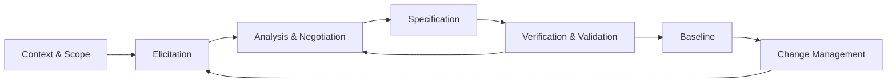

# Requirements Engineering Fundamentals

> **Mục tiêu:** hiểu requirement như một công cụ tạo đồng thuận và kiểm soát quyết định, không phải một danh sách mong muốn hoặc màn hình cần xây.

## Learning outcomes

Sau bài này, bạn có thể:

- phân biệt business need, goal, requirement, specification, business rule và design decision;
- giải thích Requirements Engineering (RE) và các hoạt động chính;
- nhận diện ambiguity, conflict và volatility;
- giải thích vì sao defect ở requirement lan truyền sang design, code và test;
- quản lý requirement bằng ID, source, rationale, status, version và baseline;
- chuyển một phát biểu mơ hồ thành tập câu hỏi phân tích được.

## 1. Bài toán mở đầu

Một business owner nói:

> Chúng ta cần một ứng dụng giao đồ ăn thật nhanh, dễ dùng và có thanh toán an toàn.

Đây là một phát biểu có giá trị vì nó chỉ ra hướng kinh doanh, nhưng chưa đủ để thiết kế hay kiểm thử:

- “nhanh” là thời gian tìm món, báo giá, đặt đơn hay giao hàng?
- “dễ dùng” với khách hàng mới, người khiếm thị hay nhân viên nhà hàng?
- “an toàn” nói về authentication, card data, fraud hay transaction consistency?
- ứng dụng có chịu trách nhiệm giao hàng hay chỉ kết nối các bên?

Requirements Engineering biến sự mơ hồ này thành hiểu biết có cấu trúc, được xác nhận và có thể truy vết.

## 2. Requirement là gì?

**Requirement** là một nhu cầu, khả năng, đặc tính hoặc điều kiện mà stakeholder cần, hoặc hệ thống phải thỏa mãn để đạt mục tiêu, tuân thủ hợp đồng, rule hay constraint.

Requirement tốt không nhất thiết mô tả giải pháp. Nó mô tả điều phải đúng trong phạm vi đã thống nhất.

### Ba cách nhìn bổ sung

| View | Requirement trả lời |
|---|---|
| Need view | Stakeholder cần kết quả hoặc giá trị gì? |
| Behavior view | Hệ thống phải phản ứng hoặc cung cấp khả năng gì? |
| Constraint/quality view | Hành vi phải diễn ra trong điều kiện và mức chất lượng nào? |

### Software requirement

**Software requirement** mô tả capability, behavior, quality hoặc constraint liên quan đến software system và các interface của nó. Nó có thể ở nhiều mức abstraction:

| Mức | Ví dụ Food Delivery |
|---|---|
| Business requirement | `BR-001`: Giảm tỷ lệ khách bỏ quy trình đặt món trước thanh toán. |
| Stakeholder need | Khách hàng cần biết tổng tiền và thời gian giao dự kiến trước khi xác nhận. |
| System requirement | `FR-012`: Khi khách yêu cầu báo giá, hệ thống phải trả về tổng tiền theo từng thành phần và thời gian giao dự kiến. |
| Acceptance criterion | `FR-012-AC-1`: Với địa chỉ nằm trong vùng phục vụ và giỏ hàng hợp lệ, báo giá hiển thị tiền món, phí giao, phí dịch vụ, giảm giá và tổng cộng. |

Các mức này liên quan nhưng không thay thế nhau. Business requirement không đủ chi tiết để test software; acceptance criterion không giải thích toàn bộ mục đích kinh doanh.

## 3. Requirement không phải là gì?

| Phát biểu | Loại chính | Vì sao |
|---|---|---|
| “Giảm 15% số đơn bị hủy do báo giá không rõ” | Business goal | Kết quả kinh doanh mong muốn |
| “Phí giao được tính theo vùng và khoảng cách” | Business rule | Chính sách quyết định hành vi |
| “Hệ thống phải hiển thị phí giao trước xác nhận” | Functional requirement | Hành vi quan sát được |
| “95% báo giá hoàn tất trong 2 giây” | Quality requirement | Mức hiệu năng đo được |
| “Phải dùng PostgreSQL” | Solution constraint | Hạn chế lựa chọn thiết kế |
| “Tạo `PricingService` với Strategy pattern” | Design decision | Cách hiện thực, chưa phải need |
| “Kiểm tra tổng tiền bằng 125.000 đồng” | Test/example | Evidence cho một trường hợp cụ thể |

Một design decision có thể trở thành constraint hợp lệ nếu có nguồn có thẩm quyền, ví dụ platform enterprise bắt buộc. Khi đó vẫn phải ghi rationale và consequence; không gọi mọi preference kỹ thuật là requirement.

## 4. Requirements Engineering là gì?

**Requirements Engineering** là quá trình có hệ thống để khám phá, phân tích, đặc tả, kiểm tra, thống nhất và quản lý requirements trong suốt vòng đời hệ thống.

RE giải quyết ba rủi ro cốt lõi:

1. **Building the wrong system:** làm đúng kỹ thuật nhưng sai nhu cầu.
2. **Building an incoherent system:** mỗi nhóm hiểu scope/rule khác nhau.
3. **Losing control of change:** không biết thay đổi ảnh hưởng artifact và stakeholder nào.

### Vòng đời RE



Đây là vòng lặp, không phải dây chuyền một chiều. Prototype có thể làm lộ need mới; design có thể làm lộ infeasibility; test design có thể phát hiện requirement không verifiable.

### Các hoạt động chính

| Hoạt động | Output điển hình | Câu hỏi |
|---|---|---|
| Context & scope | Problem statement, boundary, glossary | Hệ thống nào và vấn đề nào đang xét? |
| Stakeholder analysis | Stakeholder map | Ai có need, ảnh hưởng hoặc quyền quyết định? |
| Elicitation | Notes, observations, prototypes | Ta cần khám phá điều gì và từ nguồn nào? |
| Analysis | Classified requirements, conflicts, models | Phát biểu có rõ, đầy đủ, khả thi, nhất quán không? |
| Negotiation | Agreed priority và resolution | Khi interests xung đột, quyết định nào được chấp nhận? |
| Specification | SRS/backlog/use cases | Shared understanding được biểu diễn ra sao? |
| Verification & validation | Defect log, approval/evidence | Viết đúng chưa và đúng nhu cầu chưa? |
| Management | Baseline, change log, traceability | Thay đổi nào, vì sao, tác động gì? |

## 5. Vì sao requirements quan trọng?

Requirements là điểm nối giữa business, user, product, engineering, testing và operations. Khi điểm nối sai:

- developer tối ưu behavior không tạo giá trị;
- tester không biết expected result;
- designer lấp khoảng trống bằng assumption;
- stakeholder chỉ phát hiện khác biệt khi đã xem sản phẩm;
- change request tưởng nhỏ nhưng phá nhiều artifact.

### Cost of change

Không nên ghi nhớ một hệ số chi phí cố định cho mọi dự án. Điều ổn định về mặt reasoning là: defect càng lan qua nhiều downstream artifacts và càng được phát hiện muộn, rework thường càng lớn.

Ví dụ requirement không nói coupon được áp trước hay sau phí giao:

1. Analyst viết flow không rõ.
2. Designer đặt discount responsibility sai.
3. Backend và mobile tính khác nhau.
4. Tests ghi expected values khác nhau.
5. Finance report sai và khách khiếu nại.

Chi phí không chỉ là sửa code; còn gồm làm rõ policy, migration data, sửa interface, cập nhật test, hỗ trợ khách và mất niềm tin.

### Shift-left nhưng không đóng băng sớm

Phân tích sớm giúp giảm defect, nhưng cố “hoàn hảo hóa” mọi requirement trước khi học từ prototype cũng gây lãng phí. Mục tiêu là đưa uncertainty quan trọng ra ánh sáng sớm và dùng mức chi tiết phù hợp với quyết định sắp tới.

## 6. Requirement ambiguity

**Ambiguity** xảy ra khi một phát biểu có nhiều cách hiểu hợp lý.

### Dấu hiệu

- tính từ chủ quan: nhanh, thân thiện, dễ, mạnh, tối ưu;
- lượng từ không rõ: thường xuyên, hầu hết, phù hợp;
- đại từ/mốc tham chiếu mơ hồ: nó, trước đó, hợp lệ;
- phạm vi logic không rõ: “khách VIP và đơn trên 500.000 được miễn phí”;
- thiếu actor, trigger, condition hoặc observable response;
- thuật ngữ domain dùng không nhất quán.

### Cách xử lý

Không chỉ thay từ mơ hồ bằng con số tùy ý. Hỏi:

1. Ai quan sát thuộc tính này?
2. Trong event/environment nào?
3. Đối tượng nào được đo?
4. Measure và threshold là gì?
5. Trường hợp thất bại được xử lý ra sao?

Ví dụ:

> `QR-PERF-001`: Trong giờ cao điểm, với tối đa 5.000 yêu cầu báo giá đồng thời và dữ liệu menu đã khả dụng, 95% yêu cầu phải nhận response hợp lệ trong 2 giây và 99% trong 5 giây, đo tại API gateway.

Con số này chỉ hợp lệ sau khi được stakeholder xác nhận và feasibility được đánh giá.

## 7. Requirement conflict

**Conflict** là khi hai requirements hoặc stakeholder interests không thể đồng thời thỏa mãn trong cùng điều kiện, ngân sách hoặc release.

Ví dụ:

- Marketing muốn checkout không cần tài khoản.
- Risk team yêu cầu mọi người trả tiền phải hoàn tất identity verification.

Đừng chọn một bên bằng intuition. Phân tích:

- mục tiêu và risk đằng sau từng yêu cầu;
- regulation/policy có bắt buộc không;
- conflict xảy ra với mọi payment method hay chỉ một số trường hợp;
- alternative như guest checkout với risk limit;
- decision authority và acceptance evidence.

Resolution có thể là ưu tiên một requirement, phân đoạn condition, thay scope, hoãn release hoặc chấp nhận risk có phê duyệt.

## 8. Requirement volatility

**Volatility** là xu hướng requirement thay đổi theo thời gian do thị trường, học hỏi, regulation, dependency hoặc strategy thay đổi.

Volatility không đồng nghĩa requirement kém. Một số domain tự nhiên biến động cao, như promotion policy hoặc integration provider.

### Quản lý volatility

- ghi source và rationale để biết khi nào premise không còn đúng;
- phân biệt stable business invariant với volatile policy;
- dùng baseline/version để biết tập nào đã được chấp nhận;
- trace dependencies để impact analysis;
- ưu tiên validation/prototype cho requirement rủi ro cao;
- thiết kế variation point sau khi variation có bằng chứng.

## 9. Baseline, version và change

**Baseline** là một tập requirement đã được review và chấp thuận làm mốc cho development/change control. Baseline không có nghĩa “không được đổi”; nó có nghĩa thay đổi phải có danh tính, lý do và impact.

### Metadata tối thiểu

| Field | Ví dụ |
|---|---|
| ID | `FR-012` |
| Name | Provide itemized quote |
| Statement | Hệ thống phải trả về báo giá theo thành phần |
| Source | Product owner, Finance policy FP-07 |
| Rationale | Giảm abandonment do phí không rõ |
| Priority | Must cho Release 1 |
| Status | Reviewed |
| Version | 1.2 |
| Dependencies | `BRULE-PRICE-03`, `QR-PERF-001` |
| Acceptance links | `FR-012-AC-1`, `FR-012-AC-2` |

### Change workflow

```text
Change request
→ clarify reason and proposed change
→ identify affected requirements/artifacts/stakeholders
→ estimate value, risk, cost and schedule impact
→ approve, reject or defer
→ update source artifacts and trace links
→ communicate and revalidate
```

## 10. Worked example: từ “giao nhanh” tới analyzable requirements

### Vague statement

> Ứng dụng phải giao đồ ăn thật nhanh.

### Phân tích vấn đề

Phát biểu trộn ít nhất ba concern:

- app response time;
- thời gian restaurant preparation;
- thời gian courier delivery.

Software không hoàn toàn kiểm soát hai concern sau, nhưng có thể dự báo, thông báo, điều phối và giám sát.

### Câu hỏi làm rõ

- Thời gian nào cần cải thiện?
- Bắt đầu/kết thúc đo ở đâu?
- Vùng, thời điểm và loại đơn nào?
- Mục tiêu percentile hay average?
- Ai chịu trách nhiệm khi ETA thay đổi?
- Có được ưu tiên tốc độ hơn chi phí không?

### Kết quả phân rã

- `BR-001`: Trong ba tháng sau phát hành, giảm 10% median order-to-delivery time tại khu vực thí điểm so với baseline quý trước.
- `FR-012`: Hệ thống phải cung cấp ETA trước khi khách xác nhận đơn.
- `FR-030`: Khi ETA thay đổi quá 10 phút, hệ thống phải thông báo cho khách.
- `QR-PERF-001`: 95% yêu cầu báo giá phải hoàn tất trong 2 giây dưới workload đã xác định.
- `BRULE-ETA-01`: ETA gồm preparation estimate, courier assignment estimate và route estimate.

Đây chưa phải specification cuối. Mỗi phát biểu vẫn cần source, feasibility, acceptance criteria và validation.

## 11. Khi không nên viết requirement quá chi tiết

- Khi uncertainty chính là desirability và prototype rẻ hơn tranh luận bằng prose.
- Khi detail chưa cần cho quyết định/release hiện tại.
- Khi mô tả algorithm sẽ khóa solution dù chỉ outcome là bắt buộc.
- Khi statement chỉ lặp lại rule nằm ở nguồn có kiểm soát; nên reference và quản lý version.

“Không quá chi tiết” không có nghĩa chấp nhận ambiguity. Hãy chi tiết đúng dimension cần cho đồng thuận và test.

## 12. Common mistakes

1. Bắt đầu bằng danh sách màn hình thay vì stakeholder goals.
2. Gọi mọi mong muốn là Must.
3. Trộn requirement với design decision mà không ghi constraint source.
4. Dùng từ đo được nhưng không ghi workload/environment/measurement point.
5. Chỉ thu thập happy path.
6. Coi signed-off document là đúng vĩnh viễn.
7. Sửa downstream code nhưng không cập nhật source requirement.
8. Viết nhiều requirement atomic nhưng làm mất bức tranh end-to-end.

## 13. Requirement discovery checklist

- [ ] Problem, goal và success measure đã phân biệt?
- [ ] System boundary và external systems đã rõ?
- [ ] Stakeholder/source và decision authority đã biết?
- [ ] Statement mô tả need/behavior/quality hay solution?
- [ ] Trigger, condition, response và failure path đã xét?
- [ ] Business rules và constraints đã tách?
- [ ] Thuật ngữ có trong glossary?
- [ ] Conflict/dependency/assumption đã ghi?
- [ ] Requirement có ID, rationale, priority và status?
- [ ] Có cách verification/validation khả thi?

## 14. Practice và exam review

- [Bài tập Basic → Case Study](../08-Exercises/01-requirements.md#requirements-engineering-fundamentals)
- [Key concepts, comparison và scenario questions](../09-Exam-Preparation/01-requirements.md#requirements-engineering-fundamentals)

## 15. Summary và dependency tiếp theo

Requirements Engineering biến uncertainty thành các quyết định có thể kiểm tra và quản lý. Bước tiếp theo là xác định đúng người, quyền lợi và nguồn tri thức trong [Stakeholders](stakeholders.md).
