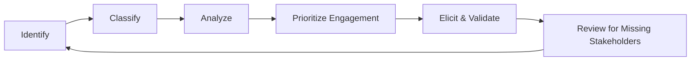

# Stakeholders

> **Mục tiêu:** tìm đúng người và hệ thống có knowledge, interest, impact hoặc authority để requirements không chỉ phản ánh tiếng nói dễ tiếp cận nhất.

## Learning outcomes

Sau bài này, bạn có thể:

- phân biệt stakeholder, user, customer và actor;
- nhận diện direct, indirect, internal, external và hidden stakeholders;
- thực hiện Identify → Classify → Analyze → Prioritize;
- đánh giá interest, influence, impact, knowledge và communication need;
- xử lý conflict và tránh bỏ sót stakeholder;
- tạo stakeholder register và engagement plan.

## 1. Stakeholder là gì?

**Stakeholder** là cá nhân, nhóm, tổ chức hoặc hệ thống có interest đối với hệ thống, có thể ảnh hưởng tới nó, bị ảnh hưởng bởi nó, cung cấp knowledge/constraint hoặc có quyền quyết định liên quan.

Stakeholder không nhất thiết trực tiếp sử dụng software. Regulator, finance, support, security team, data owner và cộng đồng bị tác động đều có thể là stakeholder.

### Tại sao cần stakeholder analysis?

Requirement không tự xuất hiện. Nó đến từ:

- goal và pain point của con người;
- business rules và operational practice;
- luật, hợp đồng và policy;
- dependency với external systems;
- capability/constraint kỹ thuật;
- risk mà một nhóm phải chịu.

Nếu thiếu stakeholder, requirement set có thể consistent nhưng vẫn thiếu một dimension quan trọng.

## 2. Stakeholder, user, customer và actor

| Concept | Trọng tâm | Ví dụ Food Delivery |
|---|---|---|
| Stakeholder | Interest, impact, knowledge hoặc authority | Customer, restaurant owner, courier operations, regulator |
| User | Người trực tiếp tương tác với sản phẩm | Khách đặt món, nhân viên nhà hàng |
| Customer | Người/tổ chức mua, tài trợ hoặc nhận giá trị hợp đồng | Business owner hoặc người đặt món tùy business model |
| Actor | Role/external entity tương tác với system boundary để đạt goal | Customer, Restaurant Staff, Payment Gateway |

### Decision rule

- Hỏi “ai bị ảnh hưởng hoặc có tiếng nói?” → stakeholder.
- Hỏi “ai trực tiếp thao tác?” → user.
- Hỏi “ai mua/tài trợ/nhận nghĩa vụ hợp đồng?” → customer.
- Hỏi “role/external entity nào trao đổi tín hiệu qua boundary?” → actor.

Một người có thể giữ nhiều role; một actor có thể đại diện nhiều người; một stakeholder có thể không phải actor.

## 3. Các stakeholder thường gặp

### User

Nguồn tốt cho workflow, usability, exception thực tế và tacit knowledge. Không nên coi user là nguồn duy nhất cho strategy, policy hoặc technical feasibility.

### Customer

Quan tâm value, scope, budget, outcome và acceptance. Customer trả tiền chưa chắc là end user; conflict giữa buyer và user cần được làm rõ.

### Business owner / Product owner

Nắm business goal, priority và trade-off authority trong phạm vi được giao. Product owner không tự động biết toàn bộ operation hoặc regulation.

### System administrator / Operations

Cung cấp requirement về provisioning, monitoring, recovery, audit, support, deployment window và operational usability.

### Developer / Architect

Đánh giá feasibility, technical dependency, integration risk và solution constraint. Họ là stakeholder nhưng không được biến preference thành business requirement không có rationale.

### Tester / Quality specialist

Phát hiện ambiguity, untestable condition, missing failure path và oracle problem. Tester tham gia sớm giúp requirement verifiable hơn.

### Security, Privacy, Legal, Compliance

Đưa ra risk, obligation, data handling và evidence requirement. Cần phân biệt luật bắt buộc, policy nội bộ và recommendation.

### Support / Customer service

Nắm recurring failure, complaint, recovery workflow và thông tin cần để chẩn đoán. Đây thường là hidden stakeholder bị mời quá muộn.

### External system

External system có thể được xem là actor trong use-case model khi tương tác qua boundary. Tổ chức sở hữu hệ thống, API team hoặc contract owner mới là stakeholder theo nghĩa social/organizational. Trong giao tiếp dự án, người ta đôi khi gọi external system là stakeholder; cần ghi convention để tránh nhầm.

## 4. Quy trình Identify → Classify → Analyze → Prioritize

## 5. Step 1 — Identify

### Câu hỏi khám phá

- Ai tài trợ, sở hữu outcome hoặc phê duyệt scope?
- Ai trực tiếp dùng, vận hành, hỗ trợ hoặc bảo trì?
- Ai cung cấp hoặc nhận dữ liệu?
- Ai chịu rủi ro tài chính, pháp lý, an toàn hoặc danh tiếng?
- Ai đặt policy/business rule?
- Ai có thể chặn release?
- Ai bị thay đổi công việc hoặc quyền lợi?
- External systems, vendors và partners nào liên quan?
- Ai đại diện nhóm dễ bị bỏ sót?

### Kỹ thuật

- system context và ecosystem map;
- organizational chart và RACI;
- process walkthrough;
- document/contract analysis;
- referral/snowball: hỏi mỗi stakeholder “còn ai cần tham gia?”;
- data flow và support ticket review;
- lifecycle thinking: build, operate, use, support, retire.

### Stakeholder onion model

Xếp theo khoảng cách với hệ thống:

1. **System:** software đang xét.
2. **Direct interaction:** users và external systems.
3. **Operational environment:** support, admin, operations.
4. **Containing organization:** owners, finance, legal, management.
5. **Wider environment:** regulators, partners, public/community.

Onion model giúp tìm nhóm không xuất hiện trên UI nhưng vẫn định hình requirement.

## 6. Step 2 — Classify

Không có một taxonomy duy nhất. Chọn classification phục vụ quyết định.

| Axis | Giá trị ví dụ | Dùng để làm gì? |
|---|---|---|
| Relation | Internal / external | Governance và communication boundary |
| Usage | Direct / indirect / non-user | Elicitation technique và usability concern |
| Stance | Supportive / neutral / resistant | Change engagement |
| Authority | Decide / approve / advise / inform | Resolve conflict |
| Impact | High / medium / low | Representation và validation effort |
| Knowledge | Domain / technical / regulatory / operational | Chọn chủ đề hỏi |

Không gắn nhãn “low importance” chỉ vì influence thấp. Một nhóm chịu impact cao nhưng ít quyền lực cần cơ chế đại diện mạnh hơn, không phải ít được lắng nghe hơn.

## 7. Step 3 — Analyze

### Stakeholder register

| Field | Câu hỏi |
|---|---|
| Stakeholder/role | Ai hoặc nhóm nào? |
| Interest/goal | Họ muốn kết quả gì? |
| Impact | Hệ thống thay đổi điều gì với họ? |
| Influence/authority | Họ quyết định hoặc chặn điều gì? |
| Knowledge | Họ biết thông tin độc quyền nào? |
| Risks/concerns | Điều gì khiến họ không chấp nhận? |
| Conflict | Goal nào có thể mâu thuẫn? |
| Engagement | Interview, workshop, review hay inform? |
| Representative | Ai có thể xác nhận thay nhóm? |

### Power–interest matrix

| | Interest thấp | Interest cao |
|---|---|---|
| Power cao | Keep satisfied | Manage closely |
| Power thấp | Monitor phù hợp | Keep informed / actively represent |

Matrix này hỗ trợ communication effort, không quyết định giá trị đạo đức hay legitimacy của need.

### Thêm dimension impact

Power–interest bỏ sót nhóm **high impact, low power**. Với hệ thống ảnh hưởng quyền lợi, accessibility, privacy hoặc livelihood, phải thêm impact/vulnerability và cơ chế validation riêng.

## 8. Step 4 — Prioritize stakeholders hay prioritize engagement?

Ta không “xếp hạng giá trị con người”. Ta ưu tiên:

- thứ tự tiếp cận;
- mức độ tham gia;
- tần suất communication;
- quyền trong từng loại quyết định;
- effort bảo đảm representation.

Tiêu chí:

- decision authority;
- uniqueness of knowledge;
- degree of impact/risk;
- dependency criticality;
- availability/time constraint;
- conflict potential.

## 9. Worked example — Food Delivery

### Scope

Nền tảng hỗ trợ khách tạo đơn, nhà hàng chấp nhận, thanh toán, phân công courier và theo dõi giao hàng. Nhà hàng chịu trách nhiệm chuẩn bị món; payment provider xử lý card transaction.

### Stakeholder register rút gọn

| Stakeholder | Interest | Impact/authority | Knowledge | Engagement |
|---|---|---|---|---|
| Customer | Giá rõ, đặt nhanh, biết trạng thái | High impact, medium influence | Journey, complaint | Interview, usability test, validation |
| Restaurant owner | Đơn chính xác, phí hợp lý | High impact | Menu, capacity, preparation | Workshop, field observation |
| Restaurant staff | Workflow ít gián đoạn | High impact, low formal power | Exception thực tế | Observation, prototype test |
| Courier | Route/assignment công bằng, an toàn | High impact | Pickup/delivery reality | Interview, ride-along observation |
| Operations | Hoàn tất đơn, xử lý incident | High authority | Escalation, monitoring | Workshop, review |
| Finance | Reconciliation đúng | Approval domain-specific | Fees, settlement | Rule review, acceptance review |
| Security/Privacy | Giảm risk dữ liệu và fraud | Can block security acceptance | Threat, policy | Threat workshop, inspection |
| Payment provider | Contract/API compliance | External dependency | API, failure modes | Contract/API review |
| Regulator | Consumer/data obligations | External authority | Legal requirement | Legal interpretation via counsel |

### Conflict example

- Customer muốn hủy bất kỳ lúc nào.
- Restaurant muốn được bồi hoàn sau khi bắt đầu chuẩn bị.
- Courier muốn không bị phạt khi khách thay đổi địa chỉ.
- Finance cần settlement nhất quán.

Conflict thực sự là allocation of cost/risk theo order state. Workshop cần state/time evidence và decision authority, không chỉ bỏ phiếu.

## 10. Missing stakeholder detection

### Dấu hiệu

- requirement set chỉ có happy path;
- không ai sở hữu failure/recovery;
- external data/API được coi là luôn khả dụng;
- quality requirements chỉ do developer viết;
- không có người đại diện accessibility/privacy;
- decision không có approver rõ;
- user group được mô tả như một persona duy nhất dù workflow khác nhau.

### Kiểm tra theo lifecycle

| Giai đoạn | Stakeholder cần xét |
|---|---|
| Acquire/onboard | Sales, identity, admin, new user |
| Operate | End users, support, operations, external providers |
| Fail/recover | Incident, finance, security, customer service |
| Change | Product, developers, migration/data owners |
| Retire | Compliance, archive, customers, operations |

## 11. Stakeholder conflict và negotiation

Quy trình:

1. Viết interests/goals, không chỉ positions.
2. Xác định condition khiến conflict xảy ra.
3. Phân biệt obligation bắt buộc với preference.
4. Thu thập data và examples.
5. Tạo alternatives và consequences.
6. Dùng đúng decision authority.
7. Ghi decision, rationale, dissent và review trigger.

Không nên dùng consensus tuyệt đối khi một stakeholder có legal accountability; cũng không nên để người có chức vụ cao quyết định usability cho user mà không có evidence.

## 12. Khi không nên dùng matrix phức tạp

- Project rất nhỏ, stakeholders ít và quan hệ rõ: một register ngắn đủ dùng.
- Matrix không thay thế cuộc trò chuyện hoặc observation.
- Không dùng score giả chính xác để che subjective judgment.
- Không công khai nhãn “resistant/low power” nếu nó gây hại quan hệ; quản lý thông tin phù hợp.

## 13. Common mistakes

1. Đồng nhất stakeholder với user.
2. Chỉ phỏng vấn manager.
3. Coi một người đại diện cho nhóm có nhu cầu rất đa dạng.
4. Không mời operations, support, security và tester sớm.
5. Xem external system như API document, bỏ qua contract owner/failure accountability.
6. Ưu tiên power và bỏ qua impact/vulnerability.
7. Không cập nhật stakeholder map khi scope thay đổi.
8. Không xác định quyền quyết định theo từng concern.

## 14. Artifact checklist

- [ ] Stakeholder map bao phủ direct, operational, organizational và external layers?
- [ ] Mỗi role có interest, impact, knowledge và authority?
- [ ] User, customer, stakeholder và actor không bị trộn?
- [ ] High-impact/low-power groups có representation?
- [ ] External system có technical và organizational owner?
- [ ] Conflict và decision authority được ghi?
- [ ] Engagement method phù hợp với knowledge cần khám phá?
- [ ] Register có owner, status và review trigger?

## 15. Practice và exam review

- [Bài tập Basic → Case Study](../08-Exercises/01-requirements.md#stakeholders)
- [Key concepts, comparison và scenario questions](../09-Exam-Preparation/01-requirements.md#stakeholders)

## 16. Summary và dependency tiếp theo

Stakeholder analysis xác định đúng nguồn knowledge, impact và authority. Bước tiếp theo là chuyển needs thành behavior quan sát được trong [Functional Requirements](functional-requirements.md), đồng thời không bỏ qua quality và constraints.
