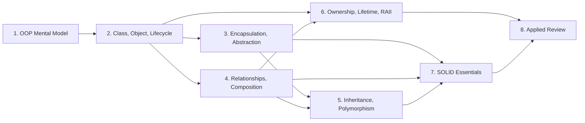
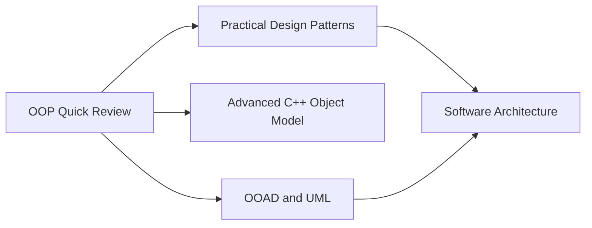

# OOP Quick Review — Topic Dependencies

## Overview

Dependency graph được giữ tối giản để người học hoàn thành track trong một ngày. Mỗi module chỉ có prerequisite thực sự cần thiết.

## 1. Core learning path

## 2. Vì sao thứ tự này hợp lý

### Class trước Encapsulation

Người học cần hiểu state, behavior và invariant trước khi đánh giá access control và API boundary.

### Relationships trước Inheritance

Học Composition và Delegation trước giúp tránh xem inheritance là cách reuse mặc định.

### Ownership sau relationships

Relationship mô tả domain/collaboration; ownership và lifetime quyết định cách biểu diễn an toàn trong C++.

### SOLID sau core mechanics

SOLID chỉ có ý nghĩa khi người học đã hiểu responsibility, contract, dependency, composition và substitutability.

### Case study cuối

Applied Review buộc người học kết hợp class design, relationships, polymorphism, ownership và SOLID trong một change scenario.

## 3. Concept dependencies

| Concept | Cần hiểu trước | Dùng để hiểu |
|---|---|---|
| Invariant | State, constructor | Encapsulation, valid object |
| Encapsulation | Class, invariant | Stable API, cohesion |
| Abstraction | Encapsulation, client need | Interface, polymorphism, DIP |
| Composition | HAS-A, ownership | Delegation, flexible behavior |
| Inheritance | Abstraction, IS-A | Subtyping, overriding |
| Dynamic dispatch | Reference/pointer, virtual function | Runtime polymorphism |
| Virtual destructor | Inheritance, lifetime | Safe polymorphic destruction |
| RAII | Constructor, destructor, ownership | Resource safety, Rule of 0 |
| SRP | Responsibility, cohesion | Class decomposition |
| OCP | Variation, abstraction | Extensibility |
| LSP | Contract, inheritance | Correct subtyping |
| ISP | Client need, interface | Focused contracts |
| DIP | Abstraction, dependency direction | Decoupled policy/detail |

## 4. Fast paths

### 3-hour refresh

Phù hợp khi đã học OOP trước đây và chỉ cần lấy lại mental model.

### C++ safety refresh

Phù hợp khi thường viết Java/C# và cần quay lại OOP trong C++.

### Design review refresh

Phù hợp với người đi làm cần review code hoặc chuẩn bị design interview cấp cơ bản.

## 5. Gate trước Applied Review

Trước Module 8, người học cần trả lời được:

1. Object nào giữ invariant?
2. Object nào sở hữu collaborator?
3. Composition hay inheritance, và vì sao?
4. Static type và dynamic type khác nhau thế nào?
5. Khi nào base destructor cần virtual?
6. `unique_ptr` và `shared_ptr` biểu diễn ownership gì?
7. SOLID principle nào liên quan đến problem cụ thể?
8. Có solution nào ít abstraction hơn không?

Nếu chưa trả lời được câu nào, quay lại đúng module prerequisite thay vì học lại toàn bộ track.

## 6. Optional dependencies sau core

Các nhánh này độc lập với completion criteria của OOP Quick Review.

