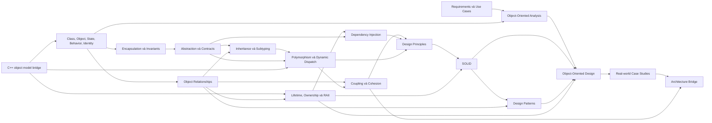
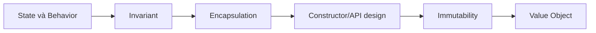
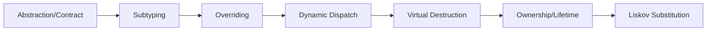
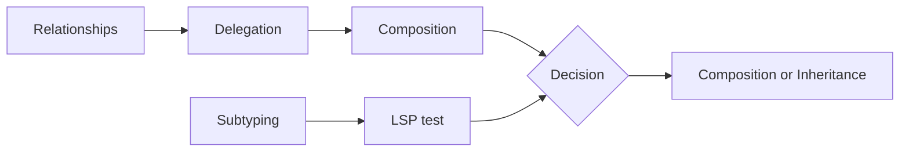
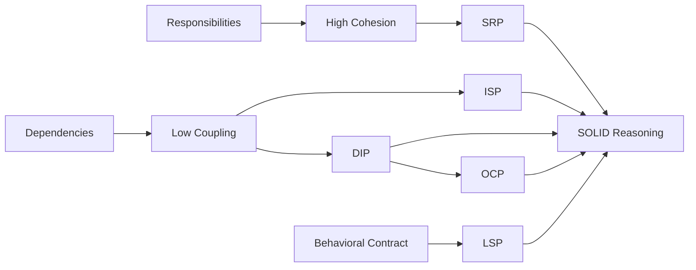
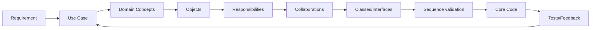
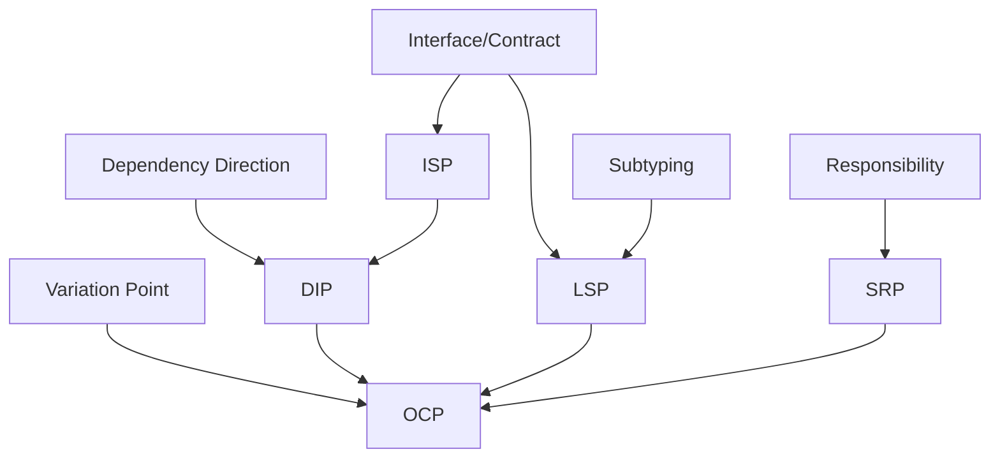
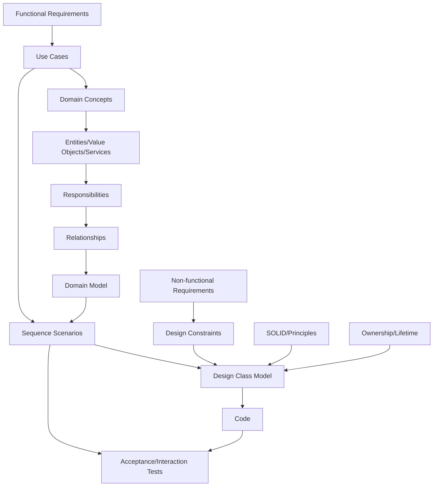

# Topic Dependencies

## Overview

Tài liệu này mô tả dependency về **năng lực hiểu và áp dụng**, không chỉ thứ tự file. Một edge `A → B` nghĩa là hiểu B ở độ sâu yêu cầu cần có A. Đây là directed acyclic graph ở cấp curriculum; khi thực hành, feedback tạo vòng lặp quay về topic trước.

## 1. Dependency graph cấp cao

### Cách đọc

- `Encapsulation → Abstraction` không có nghĩa abstraction chỉ tồn tại trong OOP; nó có nghĩa học contract abstraction trong curriculum này dựa trên boundary và invariant đã hiểu.
- `Patterns → OOD` là dependency về vocabulary triển khai, không phải yêu cầu phải dùng pattern trong mọi design.
- `Requirements → OOA` nằm song song với core OOP: có thể học use case sớm, nhưng workflow đầy đủ cần foundations.

## 2. Critical learning paths

### Path A — Thiết kế class giữ valid state

**Capability mở khóa:** thiết kế type khiến invalid state khó biểu diễn và mutation có kiểm soát.

### Path B — Runtime polymorphism an toàn

**Capability mở khóa:** dùng base interface mà không slicing, undefined behavior hoặc contract violation.

### Path C — Composition over Inheritance

**Capability mở khóa:** tách câu hỏi “có muốn reuse code không?” khỏi câu hỏi “object này có phải behavioral subtype không?”.

### Path D — SOLID và change-oriented design

**Capability mở khóa:** đánh giá design theo reason to change, client contract và dependency direction thay vì đếm class/interface.

### Path E — Requirement to Code

Đây là feedback loop chứ không phải waterfall. Test hoặc code có thể làm lộ ambiguity trong use case và buộc analysis thay đổi.

## 3. Dependency theo module

| Module | Prerequisite bắt buộc | Prerequisite hữu ích | Mở khóa |
|---|---|---|---|
| Programming Paradigms | Programming basics | Functions, lambdas | Chọn organization style theo problem |
| Class/Object | Basic C++ types/functions | Value/reference basics | Encapsulation, relationships |
| Construction/Destruction | Class/Object | Storage duration | RAII, lifetime |
| Encapsulation/Invariants | Class/Object, constructors | Error handling | Reliable class API, abstraction |
| Abstraction/Interfaces | Encapsulation | Function objects | Polymorphism, DIP |
| Inheritance/Subtyping | Abstraction, relationships | Access control | Runtime polymorphism, LSP |
| Polymorphism/Dispatch | Inheritance, abstraction, references | Compiler/linker basics | Strategy, DI, OCP |
| Relationship Modeling | Class/Object | UML basics | Ownership analysis, OOAD |
| Association/Dependency | Relationship Modeling | Header dependency | Coupling, DI |
| Aggregation/Composition | Relationship Modeling, lifetime basics | Smart pointers | Composition over Inheritance |
| Delegation | Composition, behavior | Interfaces | Strategy, Decorator, Bridge |
| Composition over Inheritance | Delegation, subtyping | LSP preview | Flexible behavior design |
| Virtual/Abstract Classes | Polymorphism | ABI awareness | Safe interface design |
| Runtime Polymorphism Safety | Virtual functions, lifetime | RTTI | Robust plugin/policy designs |
| Coupling/Cohesion | Relationships, responsibilities | Module dependencies | SRP, ISP, DIP, architecture |
| Dependency Injection | Abstraction, dependency, ownership | Testing | DIP, test seams |
| Immutability/Value Semantics | State/invariant, `const` | Concurrency basics | Value objects, safer APIs |
| Object Lifetime/Ownership | Construction/destruction | Storage duration | RAII, smart pointers |
| RAII/Smart Pointers | Lifetime/ownership | Exceptions | Rule of 0, safe graphs |
| Rule of 3 | Resource ownership | Copy semantics | Rule of 5/0 |
| Rule of 5 | Rule of 3, rvalue basics | Containers | Efficient resource types |
| Rule of 0 | RAII, Rule of 3/5 | Exception safety | Maintainable C++ classes |
| Design Principles | Coupling/cohesion, composition, polymorphism | Change analysis | SOLID/patterns |
| SRP | Responsibility, cohesion | Actor modeling | Class/module decomposition |
| ISP | Interfaces, client dependency | API evolution | Focused contracts |
| DIP | Abstraction, coupling, DI | Module boundary | OCP, architecture dependency rule |
| OCP | Variation, polymorphism, DIP | Stable abstraction | Plugin/policy extension |
| LSP | Contract, subtyping, polymorphism | Design by Contract | Correct inheritance |
| Pattern Language | Principles, relationships | Refactoring | Pattern selection |
| OO Analysis | Requirements, object fundamentals | Domain vocabulary | Domain model |
| OO Design | OOA, responsibilities, SOLID, lifetime | Patterns | Implementable class design |
| Case Studies | OOD and all core foundations | Tests | Integrated design judgment |
| Architecture Bridge | Case-study experience, coupling/DIP | Deployment/data basics | System Design foundations |

## 4. SOLID internal dependencies

SOLID không phải năm chương độc lập hoàn toàn.

### Rationale

- **SRP** cần responsibility và cohesion.
- **ISP** cần hiểu client và contract; chia interface theo method count là sai hướng.
- **DIP** cần dependency direction và abstraction ownership; DI chỉ là một mechanism hỗ trợ.
- **OCP** dựa trên variation cụ thể, thường dùng stable contract được củng cố bởi DIP/ISP/LSP.
- **LSP** cần hiểu behavioral contract sâu nhất; nó quyết định hierarchy có thực sự open for extension mà vẫn correct không.

## 5. Design Pattern prerequisites

### Creational

| Pattern | Prerequisite trực tiếp | Concept được củng cố |
|---|---|---|
| Factory Method | Polymorphism, virtual functions, OCP | Creation variation qua subclass hook |
| Abstract Factory | Interfaces, composition, product family | Compatibility và dependency inversion |
| Builder | Invariants, construction, composition | Tách construction process khỏi representation |
| Prototype | Copy semantics, polymorphism, ownership | Creation bằng cloning |
| Singleton | Lifetime, initialization, coupling, concurrency basics | Global access trade-off |

### Structural

| Pattern | Prerequisite trực tiếp | Concept được củng cố |
|---|---|---|
| Adapter | Interface, delegation | Contract translation |
| Decorator | Composition, interface polymorphism, ownership | Behavior stacking |
| Facade | Coupling, module boundary | Simplified dependency surface |
| Composite | Recursive structure, composition, polymorphism | Uniform tree treatment |
| Proxy | Interface polymorphism, lifetime | Controlled access |
| Bridge | Two variation axes, delegation, composition | Decoupled dimensions |

### Behavioral

| Pattern | Prerequisite trực tiếp | Concept được củng cố |
|---|---|---|
| Strategy | Delegation, polymorphism/functions | Encapsulated algorithm variation |
| Observer | Association, lifetime, callback | Event collaboration |
| Command | Object state, ownership, invocation | Request reification |
| State | State machine, polymorphism, delegation | State-dependent behavior |
| Template Method | Inheritance, protected hooks, LSP | Invariant algorithm skeleton |
| Chain of Responsibility | Linked composition, ownership | Dynamic request routing |
| Iterator | Encapsulation, collection, lifetime | Traversal abstraction |

## 6. OOAD dependencies

### Boundary cần giữ

- Domain concept không tự động trở thành class.
- Use case không tự động trở thành một class `UseCase`.
- Conceptual association không tự động trở thành pointer hai chiều.
- UML composition không tự động quyết định dùng `unique_ptr`; code representation còn phụ thuộc cardinality, optionality và performance.
- Pattern không được chọn trước khi interaction và change pressure xuất hiện.

## 7. Case-study dependency matrix

| Case study | Core prerequisites | Patterns có thể đánh giá, không bắt buộc | Advanced concerns được giới thiệu |
|---|---|---|---|
| Library | Entity/value distinction, relationships, policies | Strategy, Observer, State | Reservation fairness, time-based rules |
| Parking Lot | Composition, allocation/pricing variation | Strategy, Factory, State | Concurrency/hardware boundary |
| Banking | Invariants, immutability, lifetime, error handling | Command, Strategy | Atomicity, audit, idempotency |
| Hotel | Reservation lifecycle, policy variation | State, Strategy, Observer | Date ranges, availability consistency |
| E-commerce | Bounded responsibilities, DI, events | Strategy, Factory, Observer, Chain | External payment, inventory race |
| Food Delivery | State transitions, external dependencies | State, Observer, Strategy, Command | Eventual consistency, retry, location updates |

Pattern trong bảng là candidate để phân tích. Case study phải chấp nhận kết luận “không cần pattern” nếu direct design thỏa requirement và change horizon.

## 8. Parallel learning lanes

Một số nội dung có thể học song song sau khi đạt foundation:

### Lane A — C++ mechanics

Lifetime → RAII → copy/move → Rule of 0 → exception safety.

### Lane B — Object design

Responsibilities → relationships → coupling/cohesion → composition → SOLID.

### Lane C — Analysis/communication

Requirements → use cases → domain vocabulary → diagrams.

Ba lane hội tụ tại OO Design và case studies. Không nên trì hoãn toàn bộ analysis đến khi học hết C++ mechanics, nhưng không implement design polymorphic trước khi hiểu lifetime.

## 9. Optional and deferred topics

Các topic sau hữu ích nhưng không nằm trên critical path đầu tiên:

- CRTP và static polymorphism nâng cao;
- type erasure implementation chi tiết;
- concepts-based interface design;
- allocator-aware types;
- metaprogramming;
- intrusive reference counting;
- reflection proposals;
- Domain-Driven Design tactical patterns;
- concurrency patterns;
- distributed systems patterns.

Chỉ thêm chúng sau khi core curriculum ổn định, và mỗi topic phải nêu rõ prerequisite cùng learning value.

## 10. Dependency-based module gate

Trước khi bắt đầu một module, kiểm tra:

1. Người học có giải thích được prerequisite không nhìn note?
2. Có trace được code/lifecycle liên quan không?
3. Có hoàn thành mini exercise prerequisite không?
4. Module mới giải quyết problem nào chưa thể giải thích bằng model hiện tại?
5. Có cần học toàn bộ prerequisite hay chỉ một bridge section?

Trước khi chuyển module:

1. Concept coverage có thiếu mechanism quan trọng không?
2. Bad example có failure scenario cụ thể không?
3. Good example có tạo cost mới và đã nêu cost chưa?
4. C++ ownership/lifetime có liên quan và đã nói rõ chưa?
5. Connections có link đúng prerequisite/downstream topic không?
6. Exercise có đo application thay vì recall không?

## 11. Recommended first implementation sequence

Thứ tự viết tài liệu nên bắt đầu bằng một vertical foundation slice:

1. Programming Paradigms.
2. Class, Object, State, Behavior, Identity.
3. Construction, Destruction và Members.
4. Encapsulation và Invariants.
5. Abstraction và Interfaces.
6. Relationship Modeling.
7. Association, Aggregation, Composition và Dependency.
8. Inheritance và Subtyping.
9. Polymorphism và Dynamic Dispatch.
10. Object Lifetime và Ownership.
11. RAII và Smart Pointers.
12. Composition over Inheritance.

Sequence này hoàn thành một mental model đủ mạnh để bắt đầu review class design thực tế trước khi đi sâu SOLID hoặc Patterns.

## Summary

Dependency cốt lõi của curriculum là:

> object validity → abstraction boundary → relationship/ownership → substitutability/dispatch → dependency management → principles/patterns → analysis/design → architecture

Graph này ngăn ba lỗi học phổ biến: học inheritance trước contract, học patterns trước design problem và học architecture như một collection của class diagrams.

